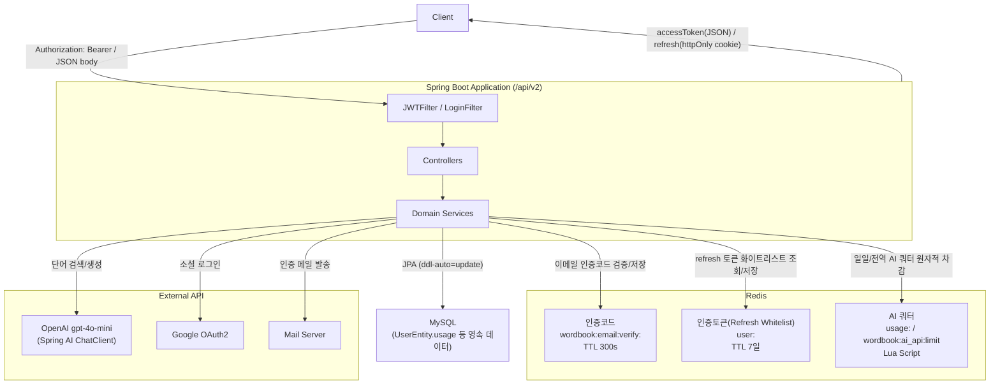
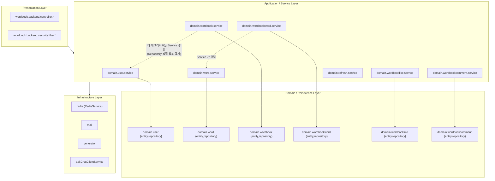
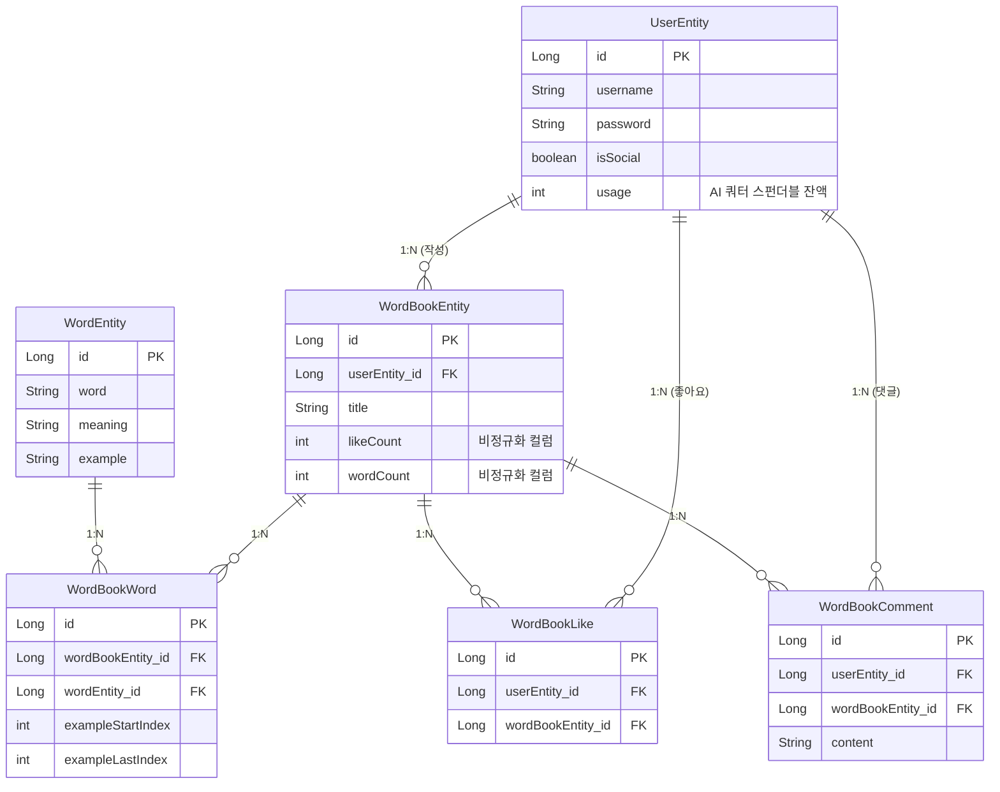
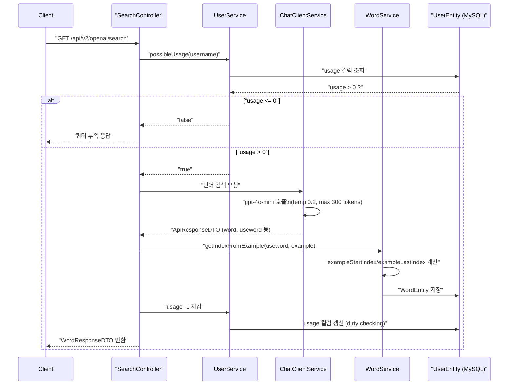

# Architecture

이 문서는 `CLAUDE.md`에 기술된 내용을 기반으로 wordbook-backend의 시스템 구성, 레이어 구조, 도메인 모델, 핵심 흐름을 시각화한다.

## 1. 시스템 구성도

**의도 및 데이터 흐름**: 모든 요청은 `JWTFilter → LoginFilter → Controller → Service` 순서로 진입하며, 인증은 완전히 stateless(JWT + Redis 화이트리스트)하게 처리된다. Redis는 단일 `RedisService` 안에서 세 가지 독립된 책임(이메일 인증코드, refresh 토큰 화이트리스트, AI 일일/전역 쿼터)을 TTL과 Lua 스크립트로 구분해 담당하고, MySQL은 사용자·단어장 등의 영속 데이터와 AI 쿼터의 스펀더블 잔액(`usage` 컬럼)을 보관한다. 외부 API(OpenAI, Google OAuth2, 메일 서버)는 각각 단어 검색, 소셜 로그인, 이메일 인증 흐름에서만 호출된다.

## 2. 레이어드 구조 및 패키지 매핑

**의도 및 데이터 흐름**: 패키지는 애그리거트(`user`, `word`, `wordbook`, `wordbookword`, `wordbooklike`, `wordbookcomment`, `refresh`) 단위로 `dto/entity/repository/service`를 함께 묶고, 횡단 관심사(`redis`, `mail`, `generator`, `api`, `security`)는 최상위에 둔다. 핵심 규칙은 서비스가 타 애그리거트의 Repository를 직접 참조하지 않고 반드시 그 애그리거트의 Service를 통해 협력하는 것이며(예: `WordBookService → UserService.findUserByUsername`), 점선 화살표가 이 경계를 나타낸다.

## 3. 도메인 ERD

**의도 및 데이터 흐름**: `WordBookWord`는 `WordBookEntity`와 `WordEntity`를 연결하는 N:M 관계의 실체 테이블로, AI가 반환한 `useword`(실제 사용된 활용형)로부터 계산된 `exampleStartIndex`/`exampleLastIndex`를 함께 들고 있어 클라이언트가 예문에서 해당 단어를 하이라이트할 수 있게 한다. `WordBookEntity`의 `likeCount`/`wordCount`는 `WordBookLike`/`WordBookWord` 증감 시 서비스 메서드(`increment*`/`decrement*`) 안에서 더티 체킹으로만 갱신되는 비정규화 컬럼이며, 모든 `@ManyToOne`은 `LAZY`이고 컬럼명은 `PhysicalNamingStrategyStandardImpl` 때문에 자동 스네이크케이스 변환 없이 명시적으로 지정된다.

## 4. 핵심 흐름 시퀀스 — AI 단어 검색 및 2-Tier 쿼터

**의도 및 데이터 흐름**: `POST /api/v2/usage`가 Redis Lua 스크립트로 일일 쿼터 "claim" 여부를 원자적으로 판정하고 성공 시 MySQL `usage` 컬럼에 +10을 적립하는 것과 별개로, 이 흐름은 그 적립된 MySQL 잔액을 실제로 "소비"하는 단계다. `UserService.possibleUsage`가 잔액을 확인해 게이트 역할을 하고, `ChatClientService`가 Spring AI `ChatClient`로 OpenAI를 호출해 엄격한 JSON 응답을 `ApiResponseDTO`로 파싱하며, `WordService`가 `useword` 기준으로 하이라이트 인덱스를 계산해 저장한 뒤 마지막으로 `usage`가 1 차감된다. 즉 Redis는 "하루치 권리 획득"을, MySQL `usage` 컬럼은 "실제 호출 시 차감되는 잔액"을 담당하는 2-Tier 구조다.
